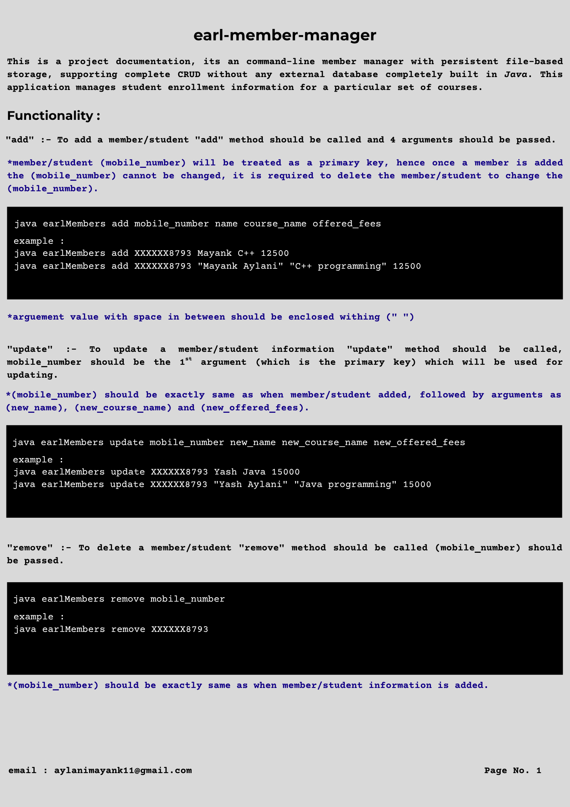
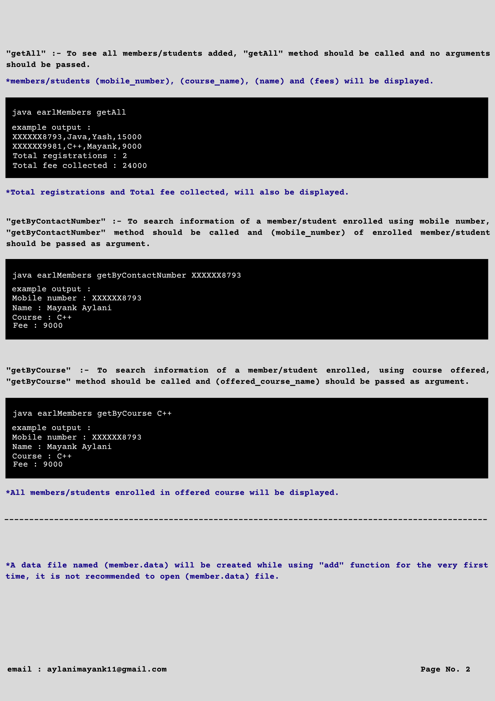

# earl-member-manager — Database-less Member Management CLI (Java)

> A lightweight command-line member management system with persistent file-based storage, supporting complete CRUD operations without any external database, built entirely in Java.

## Project Documentation

<div>
  
</div>

<br>

<div>
  
</div>

<br>

## About

`earl-member-manager` is a Java command-line application for managing member/student registration records.

Instead of using MySQL or any external database, the application uses Java's `RandomAccessFile` to read and write records directly to a local data file.

The project was built to understand low-level file I/O, persistent storage, command-line argument processing, CRUD operations, validation, exception handling, and application-level data management without relying on a database or ORM.

## Tech Used

- Java
- Java File I/O
- `RandomAccessFile`
- Command-line argument processing
- Exception handling
- Input validation
- File-based persistent storage
- Modular method-per-operation design

## Features

### CRUD Operations

- Add member/student records
- Update existing member information
- Remove members
- Retrieve all stored members

### Member Information

Each member record contains:

- Contact number
- Member name
- Enrolled course
- Registration fee

### Validation

The application:

- Rejects duplicate contact numbers
- Uses the contact number as the primary identifier
- Accepts only supported courses
- Validates registration fees
- Handles missing or invalid arguments gracefully

Supported courses:

`C`, `C++`, `Java`, `J2EE`, `Python`

### Search

Member/student information can be searched using:

- Contact number
- Enrolled course

### Aggregates

The application also displays:

- Total number of registrations
- Total fee collected

## Documentation & Usage

The first CLI argument represents the operation, followed by its required parameters.

### Add

```bash
java earlMembers add 9998887776 "Mayank Aylani" "C++" 12500
